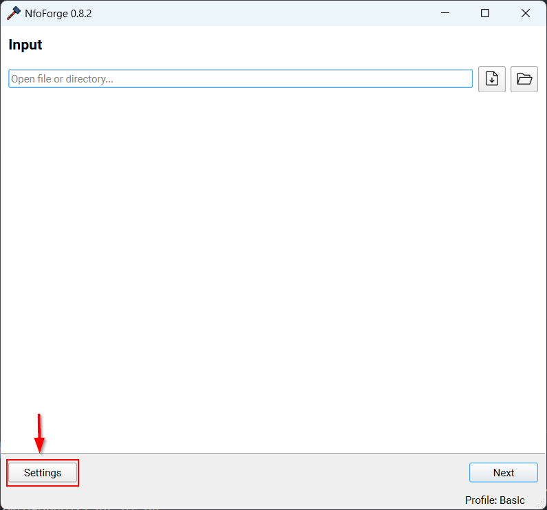
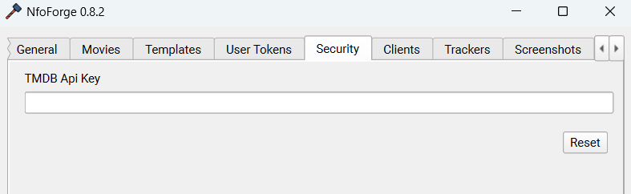
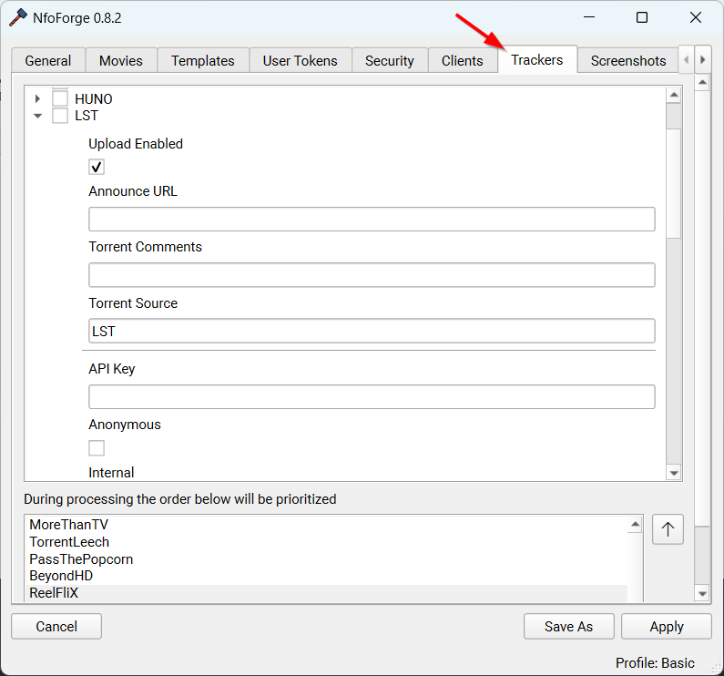

# Initial Setup

These are the minimal **required** settings that must be set in order to process files.

<!--prettier-ignore-start -->

1. Open settings.

    { width=100%, style="max-width: 500px;" }

2. Input your TMDB Api [key (v3)](https://www.themoviedb.org/settings/api).

    { width=100%, style="max-width: 500px;" }

3. Configure your desired trackers.

    { width=100%, style="max-width: 500px;" }

<!--prettier-ignore-end -->

4. Select **Apply** to save changes.

5. See [Using the Wizard](using-the-wizard.md).
