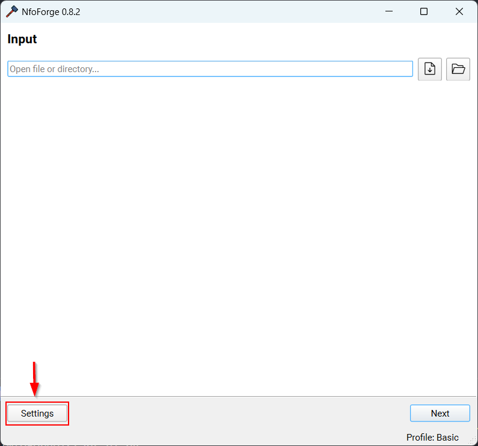
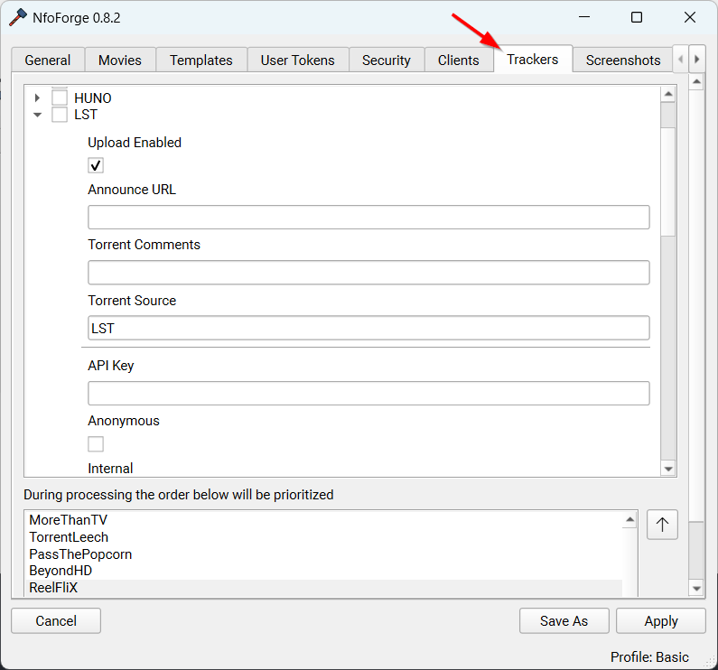

# Initial Setup

These are the minimal **required** settings that must be set in order to process files.

<!--prettier-ignore-start -->

1. Open settings.

    { width=100%, style="max-width: 500px;" }

2. Configure your desired trackers.

    { width=100%, style="max-width: 500px;" }

<!--prettier-ignore-end -->

3. Select **Apply** to save changes.

4. See [Using the Wizard](using-the-wizard.md).
