# Using the Wizard

For this guide, we'll be using the movie
[Big Buck Bunny (2008)](https://www.imdb.com/title/tt1254207/).

```text {.scrollable-code-block}
--8<-- "docs/snippets/bbb_mediainfo.txt"
```

### Input Page

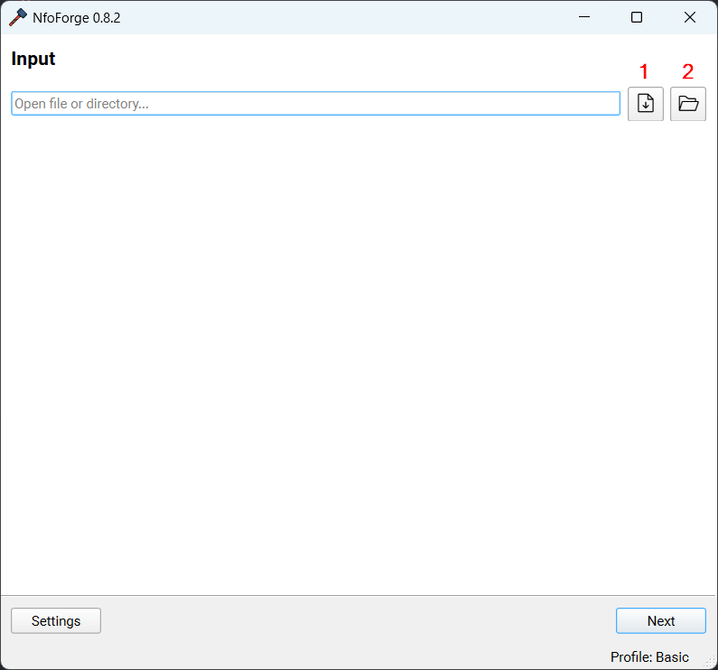{ width=100%, style="max-width:
500px;" }

Open a file or folder to start processing files. Drag and drop is also supported in the
entry bar.

1. Open file.
2. Open folder.

Once you've opened the path, you can simply select **Next**.

### Media Search Page

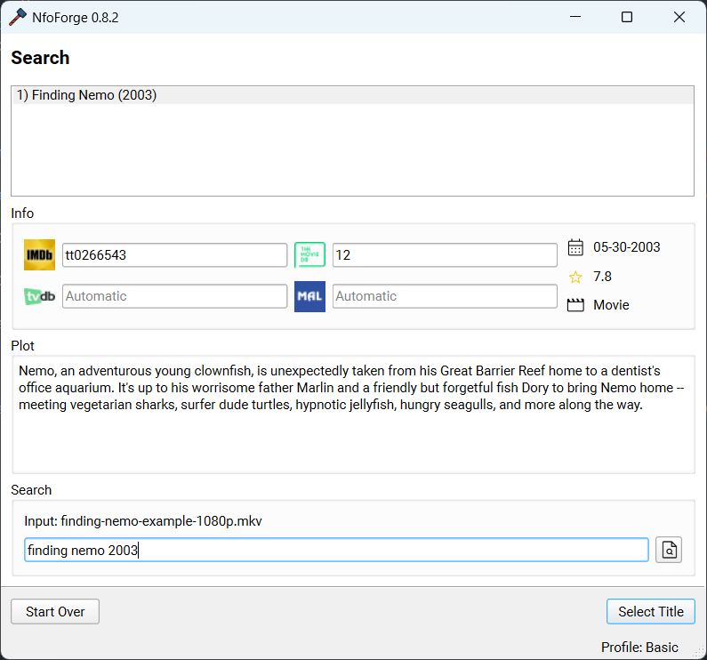{ width=100%, style="max-width:
500px;" }

The page will immediately parse the file (or attempt to, if the name is somewhat
structured) and return some results. If you find no results, refine the search below and
try again. Once you have found the appropriate title, simply select it in the top window
and press **Select Title** to continue to the next page.

NfoForge uses TMDB as its primary metadata source, then enriches series and anime
results with TVDB and AniList where applicable. If an optional metadata transformer
plugin is selected in **Settings -> Plugins**, its returned payload updates the
corresponding TMDB values; a transformer failure only produces a warning and processing
continues with TMDB.

NfoForge ships with a bundled TMDB API key, so search works out of the box with no setup
required. If you'd rather use your own account, add a personal key at **Settings ->
General -> TMDB API Key**; leave it blank to keep using the bundled key. You can
generate a free key from your
[TMDB account settings](https://www.themoviedb.org/settings/api).

IMDb, TMDB, and TVDB IDs can be entered manually. A TMDB lookup is still required
because it supplies the base metadata. If TVDB is unavailable for a series, the wizard
lets you retry or continue with the IDs and TMDB metadata you supplied.

### Rename Page

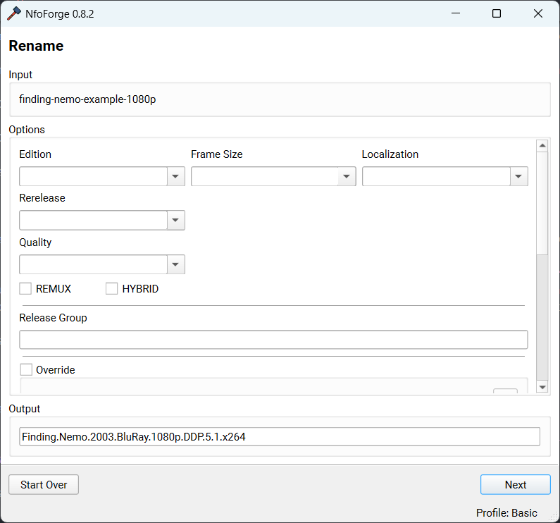{ width=100%, style="max-width: 500px;" }

<!-- prettier-ignore -->
!!! info
    As long as you have **Rename Movies/Series** ticked in **Settings -> Movies/Series Management** you will see this page. It is enabled by default.

You'll notice that the **TokenReplacer** has already used a combination of the filename,
metadata, and MediaInfo to give you a clean/proper output:
`Big.Buck.Bunny.2008.BluRay.1080p.MP2.2.0.x264`. This supports numerous overrides and
selections, but those will be covered later in the guide. For now, you can simply click
**Next** to continue.

### Images Page

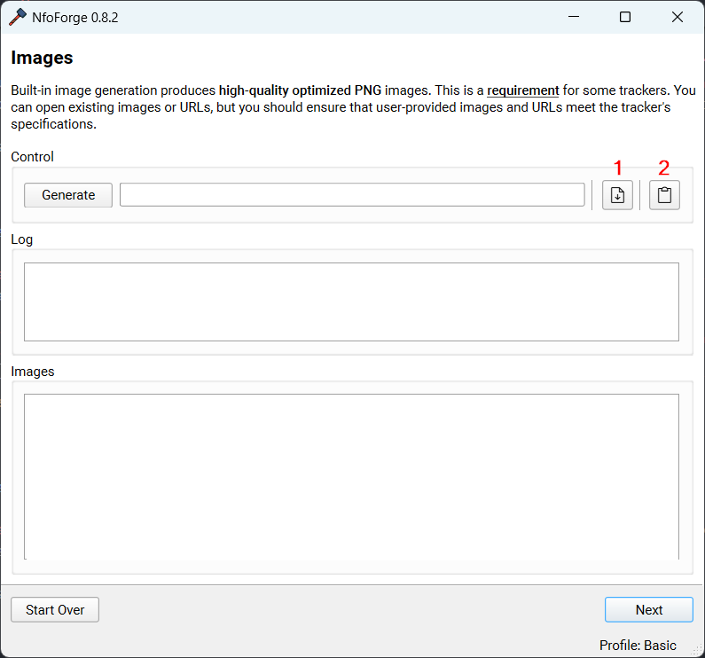{ width=100%, style="max-width: 500px;" }

<!-- prettier-ignore -->
!!! info
    As long as you have **Enable Screenshots** ticked in **Settings -> Screenshots** you will see this page. It is enabled by default.

1. Allows you to open images (.png/.jpeg) that have already been generated.
2. Allows you to paste in any type of URLs.

Generally, you should just click **Generate** and allow NfoForge to generate images
based on the current settings. This requires **FFMPEG** by default for **Basic** images.
Depending on your device speed, storage speed, and configuration, this could take a few
seconds to several minutes. Once it's done, you'll be greeted with the **Image Viewer**.

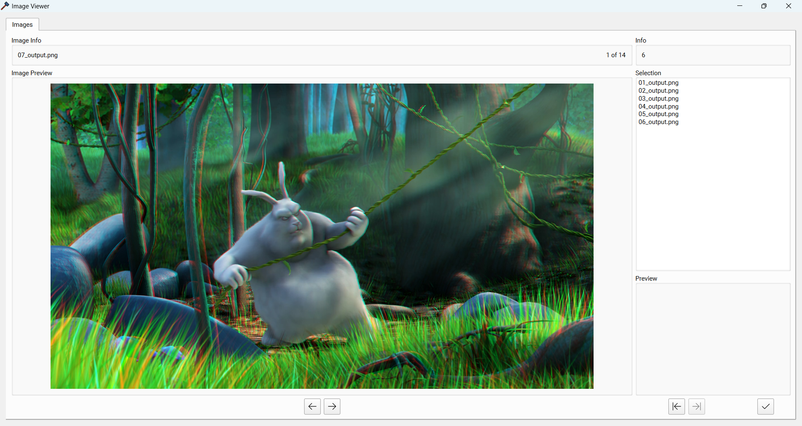{ width=100%, style="max-width:
500px;" }

You can directly view the generated images and select the images you want to use for
your upload. The left arrows navigate between images, and the arrows on the right select
or deselect images. Once you have selected your desired images, you can select the check
mark to close the window.

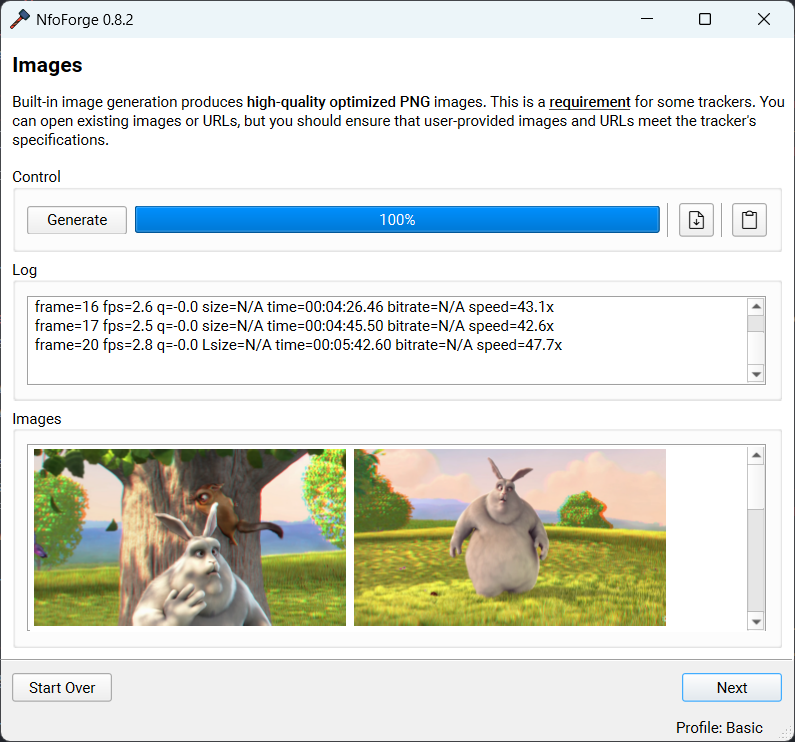{ width=100%, style="max-width: 500px;" }

Select **Next** to continue.

### Trackers Page

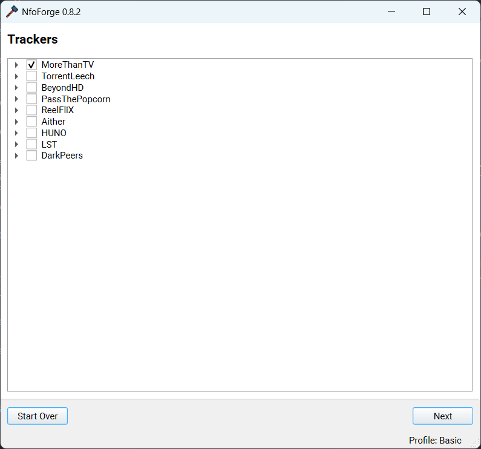{ width=100%, style="max-width: 500px;" }

This page gives you a final chance to configure trackers and select which trackers you'd
like to upload this release to. For this example, I'm going to pick a single tracker
with upload disabled (you can toggle this by expanding the tracker).

Select **Next** to continue.

### Pre-upload Page

The Pre-upload page combines the smaller final review steps so you can check template
assignments, release notes, and torrent-client options without moving through several
separate wizard pages.

#### NFO Templates

Every selected tracker must have an assigned NFO template. Existing assignments are
shown directly on the page. Select **Configure Templates** to open the full template
editor.

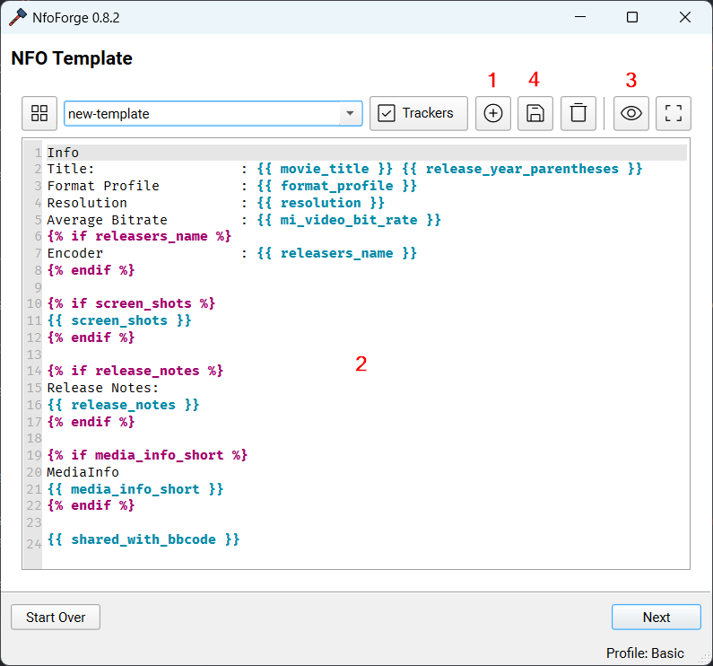{ width=100%, style="max-width: 500px;" }

By default, there won't be any templates; you must create one to continue.

<!--prettier-ignore-start -->

1. Create a new template.
2. You'll be greeted with a built-in default template that NfoForge provides.
    - This template covers the basics and is almost enough to release properly to most trackers.
    - You can customize it to your desire. A more in-depth guide of the token replacer and how it works will be covered later in the guide.
    - For now, we can use this basic template to continue.
3. You can preview the template.
    - This will show what your expected template will look like. The only portions that won't appear are those filled by **plugins** and **screenshots**, as these are executed and filled at process time later in the wizard.
4. Once satisfied with your template, you can click this to save changes or press **CTRL + S** with the text window in focus. You'll see **Saved template** in the status bar at the bottom of NfoForge.

<!--prettier-ignore-end -->

Close the editor after saving the template and assigning it to the desired trackers. The
assignment summary on Pre-upload updates automatically.

#### Release Notes

Enable **Release Notes** to create, save, or select a note to inject into the NFO. It
replaces the **{{ release_notes }}** token when that token exists in the assigned
template. Leave the section disabled to omit release notes.

#### qBittorrent

This section appears only when qBittorrent injection is enabled. It shows the
destination qBittorrent will use for the current release and lets you replace it for
this processing run.

The persistent qBittorrent setting offers three modes:

- **Client default** leaves the destination to qBittorrent and its category settings.
- **Source location** uses the selected file or folder's parent directory. For a single
  file such as `\\plex_server\movies\Cleaner (2025)\Cleaner.2025.mkv`, the resulting
  save location is `\\plex_server\movies\Cleaner (2025)`.
- **Template** renders a full path with existing FileTokens, for example
  `\\plex_server\movies\{title_exact} {release_year_parentheses}`.

An edited value on Pre-upload overrides the configured mode for that run and applies to
every tracker torrent injected into qBittorrent. Use **Reset to Configured Default** to
discard the override.

<!-- prettier-ignore -->
!!! warning
    The path is interpreted by qBittorrent, not necessarily by the computer
    running NfoForge. A remote host, container, or Windows service must be able
    to access the path. When NfoForge supplies a path, qBittorrent automatic
    torrent management is disabled so category rules do not relocate it.

Select **Next** after the page reports no blocking configuration problems.

### Process Page

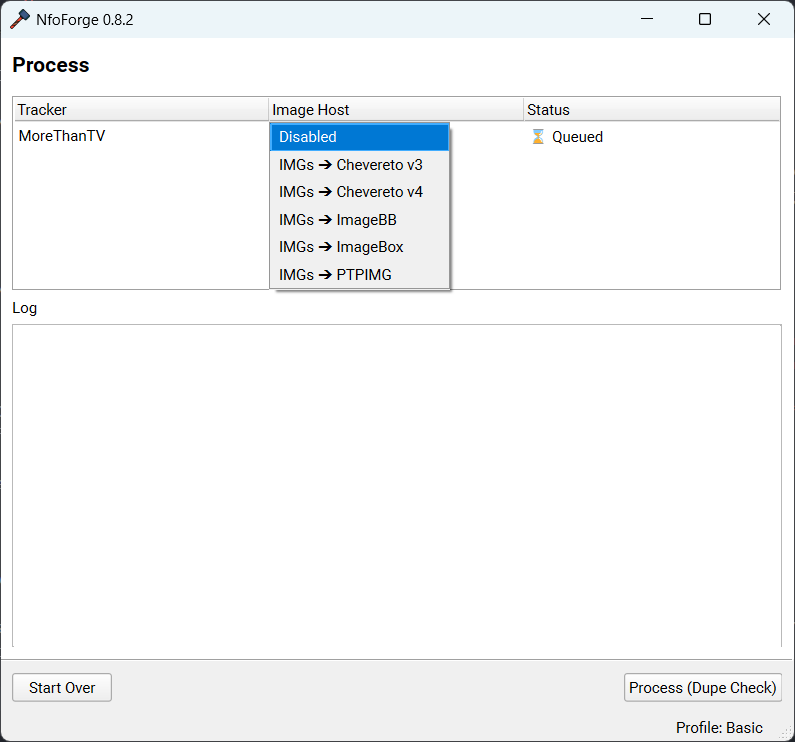{ width=100%, style="max-width: 500px;" }

This is the final page where all the processing takes place. If you configured an image
host, you'll see it in the drop-down menu.

Select the host and click **Process (Dupe Check)**.

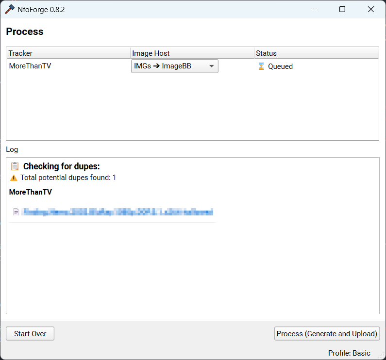{ width=100%, style="max-width: 500px;"
}

You'll notice that there is one duplicate release found. You can review this and decide
if there is a duplicate for your release. If not, simply click **Process (Generate and
Upload)** to continue.

#### Overview and Edit

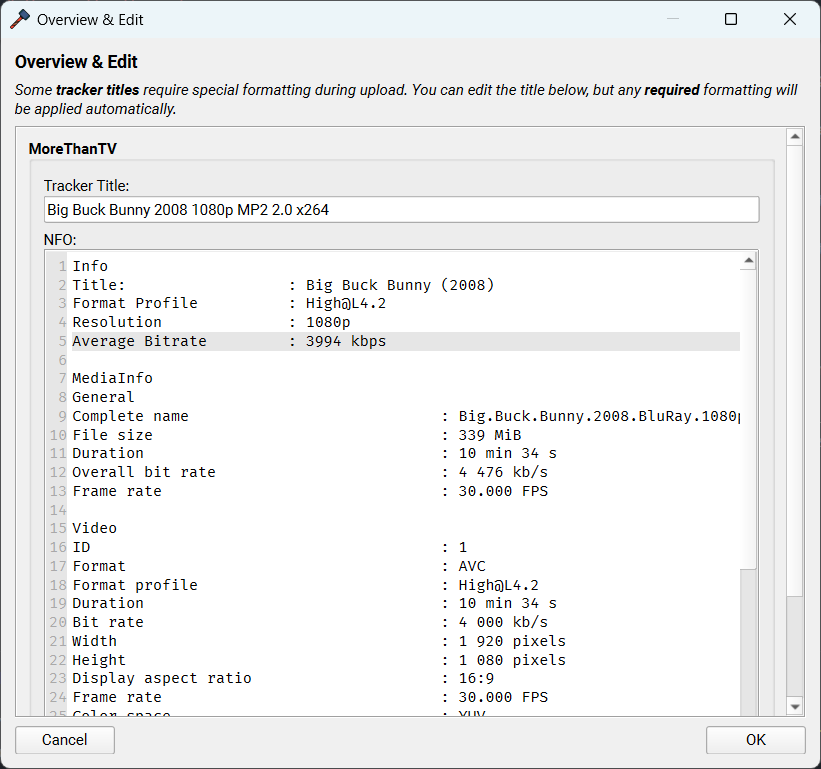{ width=100%, style="max-width:
500px;" }

- If enabled _(Settings -> General -> Prompt for Overview)_ this window will appear.
- You can edit the final formatted NFO.
- You can also edit the tracker title _(if available)_.

After reviewing, press OK to apply your changes. If you close the window or press
Cancel, your previous data will be used. Processing will continue automatically after
you close this window.

**Note:** Some trackers require specific formatting to the tracker title. This will be
applied during upload regardless of edits in this window.

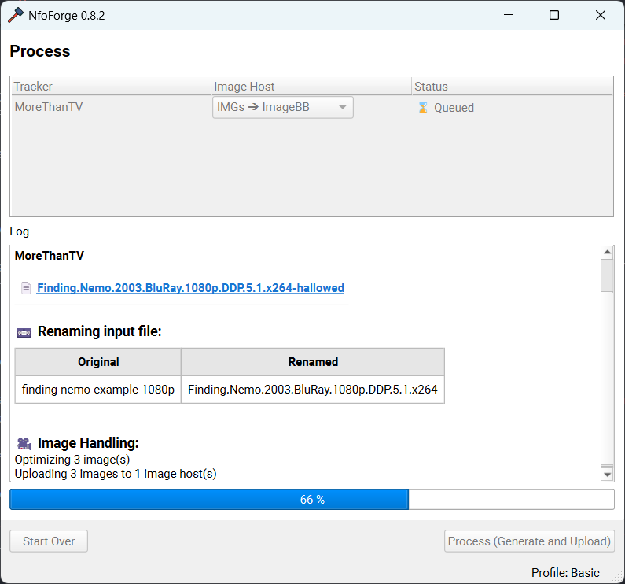{ width=100%, style="max-width:
500px;" }

During processing, you'll notice everything is disabled other than the log window, so
you can scroll up and down. After things are complete, you'll see an output similar to
this.

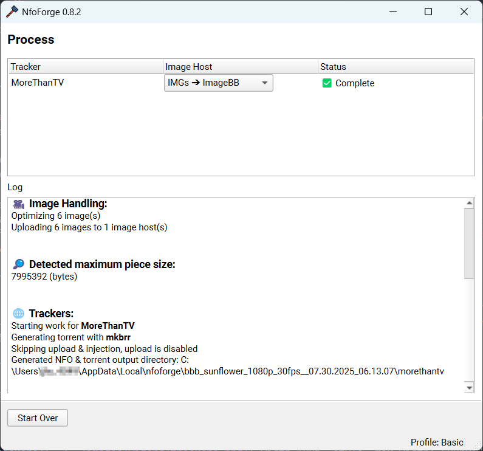{ width=100%,
style="max-width: 500px;" }

Notice the status ✅ Complete and no errors in the log. Your torrent should be uploaded
to the selected tracker (if you chose to upload). Any generated torrents/NFO files can
be found in the path displayed in the log window. You can view the created NFO for each
tracker you selected.

**Example from this guide**

```text {.scrollable-code-block}
--8<-- "docs/snippets/successful_release.txt"
```

### Saved Jobs

A configured upload can be saved and processed later, including after closing NfoForge.
Two buttons on the Process Page do this:

- **Save Job** stores the run as it stands. Loading it later picks up at the Process
  Page, and everything that needs a decision -- prompt tokens, the overview dialog -- is
  still asked at that point.
- **Prepare && Save Job** runs everything except the upload: screenshots go to the image
  host, the torrent is generated, and titles and NFOs are written. The saved job then
  only needs uploading, and asks nothing when it runs.

**Jobs** on the start page opens the saved-job window. Filter by name, title or tracker,
sort by any column, and select a job to see what it holds -- its trackers and their
image hosts, how many screenshots it carries, where its media is and how much disk it
uses. Add prepared jobs to the queue panel to upload several in a row.

A job whose source media is no longer where it was saved is flagged with a warning icon
and cannot be processed until the file is back. **Rename** (or F2) changes a job's name
without touching anything else about it. Selecting several jobs and pressing **Delete**
removes them together -- along with their screenshots, MediaInfo, NFOs and torrents,
which cannot be undone.

Each job is a self-contained folder under `<working directory>/jobs`, holding its own
screenshots, MediaInfo, NFOs and a copy of the torrent. Settings -> General **Clean Up**
never touches it, so housekeeping cannot destroy saved work, and deleting a job reclaims
exactly what it was using.

Resuming reuses what it can. Screenshots already uploaded are not sent again while the
tracker's image host is unchanged, MediaInfo comes from the stored dumps rather than the
media file, and the torrent is cloned instead of re-hashed as long as every file it
covers is unchanged.

Duplicate checks are deliberately _not_ run at save time. They run immediately before
uploading, where the answer is current.

#### Jobs and Config Profiles

A job records the config profile it was built under but stores no settings of its own --
credentials, templates and per-tracker options are read live at resume time. Jobs
belonging to another config are greyed out and open only via **Switch profile and
load**, since resuming under a different config would silently use its credentials and
templates. Loading also warns when the active config has disabled one of the job's
trackers or is missing an NFO template it needs.

NFO templates are shared across configs. A prepared job uploads the NFO it prepared, so
editing the template afterwards does not change what it sends -- loading the job says
which template changed so the difference is not silent.

#### The Queue

Select prepared jobs on the current config, add them to the queue in the order you want
them run, and press **Run Queue**. The queue window lists every job and expands the
running one to show each tracker's status underneath it. A job that finishes cleanly
collapses to a single line; one that had a problem stays open on the tracker that
explains why. The queue can be stopped between jobs -- the one currently uploading is
always left to finish, since interrupting an upload is what risks a half-sent release.

Only prepared jobs qualify: anything else would stop at a prompt with nobody to answer
it. A job is skipped and kept for review when its duplicate check finds something _or_
when that check could not complete -- unverified counts the same as found, because the
queue cannot ask what the interactive flow asks.

Once a job has run, its files are brought into line with what actually uploaded.
Trackers that uploaded are removed from it; if none are left, the job is deleted.
Everything else about the job stays untouched: a tracker that failed, was never
attempted, was skipped, or is switched off in the current config is still there to try
again, and one whose fate could not be established is left for you to judge.
