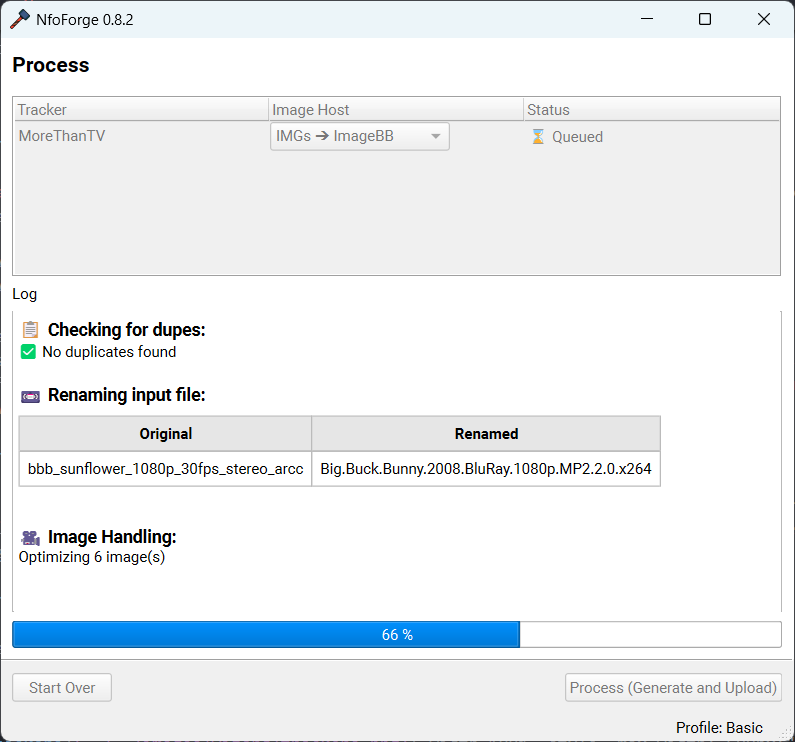

# Using the Wizard

For this guide, we'll be using the movie [Big Buck Bunny (2008)](https://www.imdb.com/title/tt1254207/).

```text {.scrollable-code-block}
--8<-- "docs/snippets/bbb_mediainfo.txt"
```

### Input Page

{ width=100%, style="max-width: 500px;" }

Open a file or folder to start processing files. Drag and drop is also supported in the entry bar.

1. Open file.
2. Open folder.

Once you've opened the path, you can simply select **Next**.

### Media Search Page

{ width=100%, style="max-width: 500px;" }

The page will immediately parse the file (or attempt to, if the name is somewhat structured) and return some results. If you find no results, refine the search below and try again. Once you have found the appropriate title, simply select it in the top window and press **Select Title** to continue to the next page.

This will parse TMDB, IMDb, TVDb, and Anilist to return metadata for the selected title.

### Rename Page

{ width=100%, style="max-width: 500px;" }

<small>_As long as you have **Rename Movie** ticked in **Settings -> Movie** you will see this page. It is enabled by default._</small>

You'll notice that the **TokenReplacer** engine has already used a combination of the filename, metadata, and MediaInfo to give you a clean/proper output: `Big.Buck.Bunny.2008.BluRay.1080p.MP2.2.0.x264`. This supports numerous overrides and selections, but those will be covered later in the guide. For now, you can simply click **Next** to continue.

### Images Page

{ width=100%, style="max-width: 500px;" }

<small>_As long as you have **Enable Screenshots** ticked in **Settings -> Screenshots** you will see this page. It is enabled by default._</small>

1. Allows you to open images (.png/.jpeg) that have already been generated.
2. Allows you to paste in any type of URLs.

Generally, you should just click **Generate** and allow NfoForge to generate images based on the current settings. This requires **FFMPEG** by default for **Basic** images. Depending on your device speed, storage speed, and configuration, this could take a few seconds to several minutes. Once it's done, you'll be greeted with the **Image Viewer**.

{ width=100%, style="max-width: 500px;" }

You can directly view the generated images and select the images you want to use for your upload. The left arrows navigate between images, and the arrows on the right select or deselect images. Once you have selected your desired images, you can select the check mark to close the window.

{ width=100%, style="max-width: 500px;" }

Select **Next** to continue.

### Trackers Page

{ width=100%, style="max-width: 500px;" }

This page gives you a final chance to configure trackers and select which trackers you'd like to upload this release to. For this example, I'm going to use **MoreThanTV** with upload disabled (you can toggle this by expanding the tracker).

Select **Next** to continue.

### Release Notes Page

{ width=100%, style="max-width: 500px;" }

This page allows you to create, save, or select a custom release note to inject into the NFO. It will replace the token **{{ release_notes }}** if it exists in the template.

Select **Next** to continue.

### Template Page

{ width=100%, style="max-width: 500px;" }

This page is quite advanced. However, for this example, we will go over basic usage. By default, there won't be any templates; you must create one to continue.

1. Create a new template.
2. You'll be greeted with a built-in default template that NfoForge provides.
    - This template covers the basics and is almost enough to release properly to most trackers.
    - You can customize it to your desire. A more in-depth guide of the token replacer and how it works will be covered later in the guide.
    - For now, we can use this basic template to continue.
3. You can preview the template.
    - This will show what your expected template will look like. The only portions that won't appear are those filled by **plugins** and **screenshots**, as these are executed and filled at process time later in the wizard.
4. Once satisfied with your template, you can click this to save changes or press **CTRL + S** with the text window in focus. You'll see **Saved template** in the status bar at the bottom of NfoForge.

Select **Next** to continue.

### Overview Page

{ width=100%, style="max-width: 500px;" }

This page allows you to quickly see everything that will happen during processing. You can simply click **Next** to continue.

### Process Page

{ width=100%, style="max-width: 500px;" }

This is the final page where all the processing takes place. If you configured an image host, you'll see it in the drop-down menu.

Select the host and click **Process (Dupe Check)**.

{ width=100%, style="max-width: 500px;" }

You'll notice that there is one duplicate release found. You can review this and decide if there is a duplicate for your release. If not, simply click **Process (Generate and Upload)** to continue.

{ width=100%, style="max-width: 500px;" }

During processing, you'll notice everything is disabled other than the log window, so you can scroll up and down. After things are complete, you'll see an output similar to this.

{ width=100%, style="max-width: 500px;" }

Notice the status ✅ Complete and no errors in the log. Your torrent should be uploaded to the selected tracker (if you chose to upload). Any generated torrents/NFO files can be found in the path displayed in the log window. You can view the created NFO for each tracker you selected.

**Example from this guide**

```text {.scrollable-code-block}
--8<-- "docs/snippets/successful_release.txt"
```
