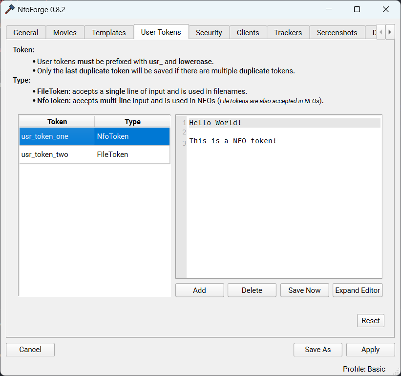
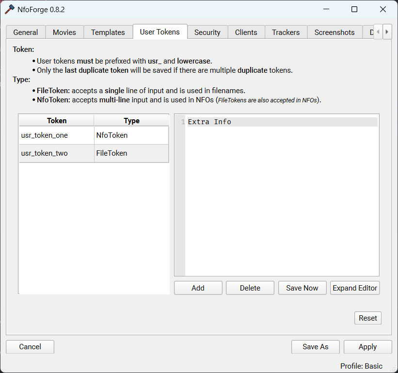
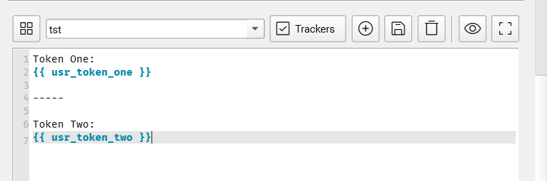
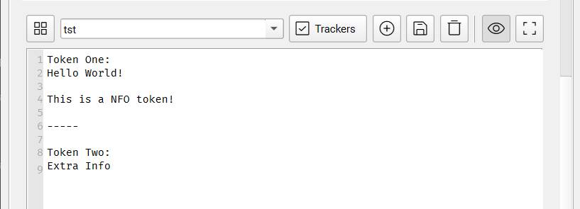
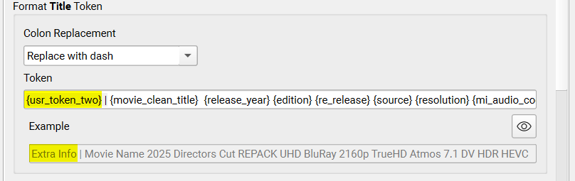

# Advanced

We'll go over some advanced use cases.

### User Tokens

In NfoForge, open **Settings → User Tokens** to manage user tokens.

#### Adding a User Token

To add a new token, select **Add**.

- **Double click** the cell in the **Token** column that you just created to modify the token name.
- **Double click** the cell in the **Type** column that you just created to select the desired token type.

<!-- prettier-ignore -->
!!! question "What is the difference between FileTokens and NfoTokens?"
    **FileTokens** are used for file paths and are accessible everywhere file paths are needed.  
    **NfoTokens** are only available within NFO templates and cannot be used for file paths. NFOs, however, can use all FileTokens.

Below are two newly created tokens.

#### User NfoToken

{ width=100%, style="max-width: 500px;" }

#### User FileToken

{ width=100%, style="max-width: 500px;" }

#### Example Usage

Below is an **NFO** template using our two example tokens.

{ width=100%, style="max-width: 500px;" }

Output

{ width=100%, style="max-width: 500px;" }

Example of **file path** token.

{ width=100%, style="max-width: 500px;" }

### Global Tokens

These tokens are meant to be used in NFO templates. Each global token is prefixed with `nf_`.

#### Token Objects

All token objects resets to empty on **Start Over** or wizard reset. These tokens are updated dynamically throughout the flow of the program. Having this data available can be very powerful for advanced users.

###### {{ nf_shared_data }}

This token gives the user access to the **SharedPayload** dataclass. The field **dynamic_data** is specifically designed for **plugins** and numerous other functions that get filled throughout the workflow.

```python
@dataclass(slots=True)
class SharedPayload:
    url_data: list[ImageUploadData] = field(default_factory=list)
    selected_trackers: Sequence[TrackerSelection] | None = None
    loaded_images: Sequence[Path] | None = None
    generated_images: bool = False
    is_comparison_images: bool = False
    dynamic_data: dict[str, Any] = field(default_factory=dict)
    release_notes: str | None = None

    def reset(self) -> None:
        self.url_data.clear()
        self.selected_trackers = None
        self.loaded_images = None
        self.generated_images = False
        self.is_comparison_images = False
        self.dynamic_data.clear()
        self.release_notes = None
```

###### {{ nf_media_search_payload }}

This token gives the user access to the **MediaSearchPayload** dataclass.

```python
@dataclass(slots=True)
class MediaSearchPayload:
    imdb_id: str | None = None
    imdb_data: Movie | None = None
    tmdb_id: str | None = None
    tmdb_data: dict | None = None
    tvdb_id: str | None = None
    tvdb_data: dict | None = None
    anilist_id: str | None = None
    anilist_data: dict | None = None
    mal_id: str | None = None
    title: str | None = None
    year: int | None = None
    original_title: str | None = None
    genres: list[TMDBGenreIDsMovies | TMDBGenreIDsSeries] = field(default_factory=list)

    def reset(self) -> None:
        self.imdb_id = None
        self.imdb_data = None
        self.tmdb_id = None
        self.tmdb_data = None
        self.tvdb_id = None
        self.tvdb_data = None
        self.anilist_id = None
        self.anilist_data = None
        self.mal_id = None
        self.title = None
        self.year = None
        self.original_title = None
        self.genres.clear()
```

###### {{ nf_media_input_payload }}

This token gives the user access to the **MediaInputPayload** dataclass.

```python
@dataclass(slots=True)
class MediaInputPayload:
    script_file: Path | None = None
    source_file: Path | None = None
    source_file_mi_obj: MediaInfo | None = None
    encode_file: Path | None = None
    encode_file_mi_obj: MediaInfo | None = None
    encode_file_dir: Path | None = None
    renamed_file: Path | None = None
    working_dir: Path | None = None

    def reset(self) -> None:
        self.script_file = None
        self.source_file = None
        self.source_file_mi_obj = None
        self.encode_file = None
        self.encode_file_mi_obj = None
        self.encode_file_dir = None
        self.renamed_file = None
        self.working_dir = None
```

###### Example Usage

Displaying the object directly in the template.

```text
{{ nf_media_input_payload }}
```

```text
MediaInputPayload(script_file=None, source_file=None, source_file_mi_obj=None, encode_file=WindowsPath('C:/Users/user/Desktop/sample/example/Big.Buck.Bunny.2008.BluRay.1080p.MP2.2.0.x264.mp4'), encode_file_mi_obj=<pymediainfo.MediaInfo object at 0x00000210F6087B90>, encode_file_dir=None, renamed_file=None, working_dir=WindowsPath('C:/Users/user/AppData/Local/nfoforge/Big.Buck.Bunny.2008.BluRay_08.04.2025_02.21.24'))
```

You can use the object above in a template. This is a [PyMediaInfo object](https://github.com/sbraz/pymediainfo) utilizing the method `to_data()`.

```jinja

{{ nf_media_input_payload.encode_file_mi_obj.to_data() }}

```

```python {.scrollable-code-block}
--8<-- "docs/snippets/bbb_pymediainfo.txt"
```

To display the **duration** of the loaded object, first check that the object exists. Then, set a variable named `general_track` to the first general track, and access the first value in its `other_duration` list:

```jinja


{{ general_track.other_duration[0] }}

```

```
10 min 34 s
```
