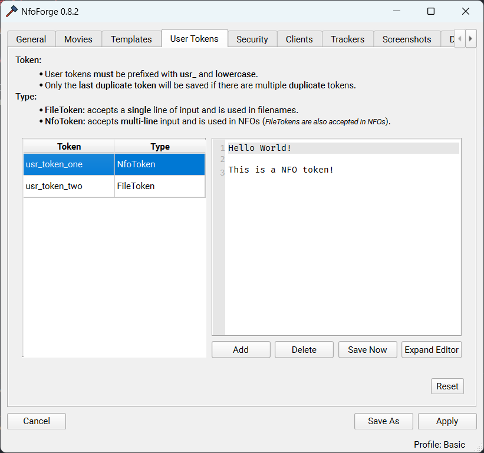
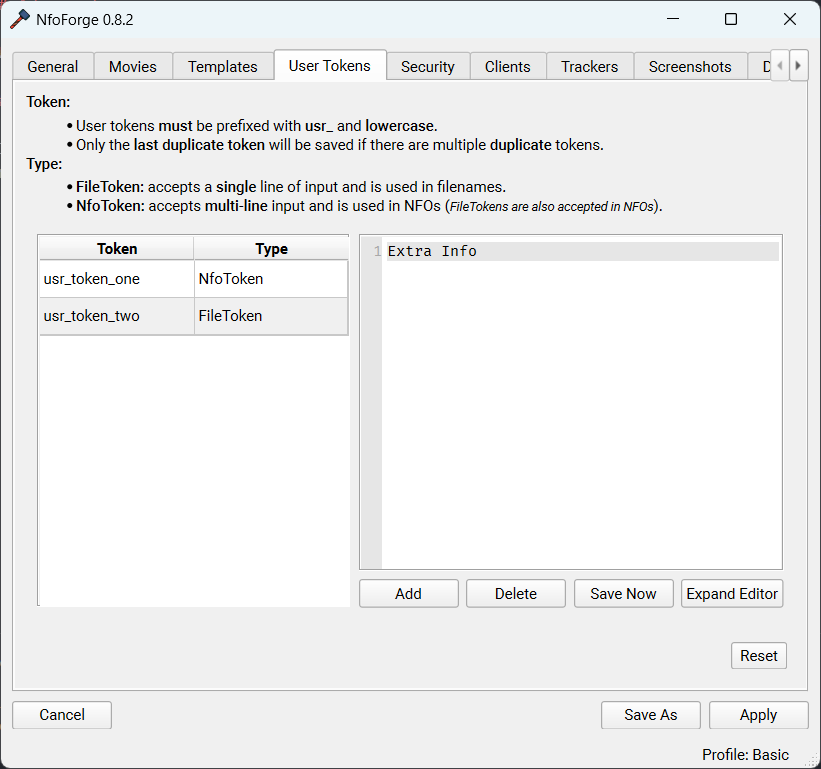
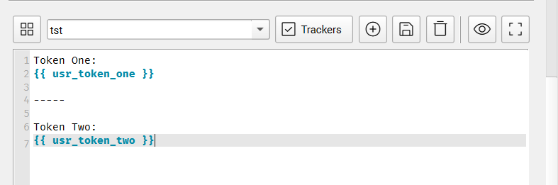
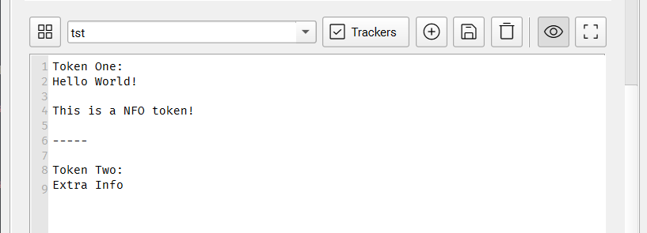
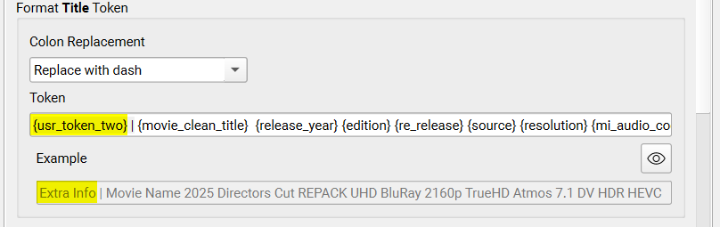

# Advanced

We'll go over some advanced use cases.

### User Tokens

In NfoForge, open **Settings → User Tokens** to manage user tokens.

#### Adding a User Token

To add a new token, select **Add**.

- **Double click** the cell in the **Token** column that you just created to modify the token name.
- **Double click** the cell in the **Type** column that you just created to select the desired token type.

<!-- prettier-ignore -->
!!! question "What is the difference between FileTokens and NfoTokens?"
    **FileTokens** are used for file paths and are accessible everywhere file paths are needed.  
    **NfoTokens** are only available within NFO templates and cannot be used for file paths. NFOs, however, can use all FileTokens.

Below are two newly created tokens.

#### User NfoToken

{ width=100%, style="max-width: 500px;" }

#### User FileToken

{ width=100%, style="max-width: 500px;" }

#### Example Usage

Below is an **NFO** template using our two example tokens.

{ width=100%, style="max-width: 500px;" }

Output

{ width=100%, style="max-width: 500px;" }

Example of **file path** token.

{ width=100%, style="max-width: 500px;" }

### Global Tokens

These tokens are meant to be used in NFO templates. Each global token is prefixed with `nf_`.

#### Token Objects

All token objects resets to empty on **Start Over** or wizard reset. These tokens are updated dynamically throughout the flow of the program. Having this data available can be very powerful for advanced users.

###### {{ nf_shared_data }}

This token gives the user access to the **SharedPayload** dataclass. The field **dynamic_data** is specifically designed for **plugins** and numerous other functions that get filled throughout the workflow.

```python
@dataclass(slots=True)
class SharedPayload:
    url_data: list[ImageUploadData] = field(default_factory=list)
    selected_trackers: Sequence[TrackerSelection] | None = None
    loaded_images: Sequence[Path] | None = None
    generated_images: bool = False
    is_comparison_images: bool = False
    dynamic_data: dict[str, Any] = field(default_factory=dict)
    release_notes: str | None = None

    def reset(self) -> None:
        self.url_data.clear()
        self.selected_trackers = None
        self.loaded_images = None
        self.generated_images = False
        self.is_comparison_images = False
        self.dynamic_data.clear()
        self.release_notes = None
```

###### {{ nf_media_search_payload }}

This token gives the user access to the **MediaSearchPayload** dataclass.

```python
@dataclass(slots=True)
class MediaSearchPayload:
    media_type: MediaType | None = None
    imdb_id: str | None = None
    provider_metadata: MetadataProviderResult | None = None
    tmdb_id: str | None = None
    tmdb_data: dict | None = None
    tvdb_id: str | None = None
    tvdb_data: dict | None = None
    anilist_id: str | None = None
    anilist_data: dict | None = None
    mal_id: str | None = None
    title: str | None = None
    year: int | None = None
    original_title: str | None = None
    genres: list[TMDBGenreIDsMovies | TMDBGenreIDsSeries] = field(default_factory=list)
    plot: str | None = None
    poster_url: str | None = None
    genre_names: tuple[str, ...] = ()
    media_kind: MetadataMediaKind | None = None

    def merge_metadata(
        self, provider_metadata: MetadataProviderResult | None = None
    ) -> None:
        ...

    def reset(self) -> None:
        self.media_type = None
        self.imdb_id = None
        self.provider_metadata = None
        self.tmdb_id = None
        self.tmdb_data = None
        self.tvdb_id = None
        self.tvdb_data = None
        self.anilist_id = None
        self.anilist_data = None
        self.mal_id = None
        self.title = None
        self.year = None
        self.original_title = None
        self.genres.clear()
        self.plot = None
        self.poster_url = None
        self.genre_names = ()
        self.media_kind = None
```

###### {{ nf_media_input_payload }}

This token gives the user access to the **MediaInputPayload** dataclass.

```python
@dataclass(slots=True)
class MediaInputPayload:
    input_path: Path | None = None
    media_type: MediaType | None = None
    working_dir: Path | None = None
    file_list: list[Path] = field(default_factory=list)
    file_list_mediainfo: dict[Path, MediaInfo] = field(default_factory=dict)
    comparison_pair: ComparisonPair | None = None
    series_episode_map: dict[Path, dict] | None = None
    series_episode_format: EpisodeFormat = EpisodeFormat.STANDARD

    def has_basic_data(self) -> bool:
        ...

    def require_input_path(self) -> Path:
        ...

    def require_media_type(self) -> MediaType:
        ...

    def require_working_dir(self) -> Path:
        ...

    def require_existing_media_paths(self, *, include_comparison: bool) -> None:
        ...

    def get_first_file(self, raise_error: bool = False) -> Path | None:
        ...

    def require_first_file(self) -> Path:
        ...

    def get_mediainfo(self, fp: Path) -> MediaInfo | None:
        ...

    def require_mediainfo(self, fp: Path) -> MediaInfo:
        ...

    def reset(self, input_path: Path | None = None) -> None:
        ...
```

###### Example Usage

The payload now exposes the selected input path, the discovered file list, and cached MediaInfo objects keyed by file path.

You can pull the first discovered file and its MediaInfo from the payload in a template.

```jinja



{{ media_info.to_data() }}

```

```python {.scrollable-code-block}
--8<-- "docs/snippets/bbb_pymediainfo.txt"
```

To display the **duration** of the loaded object, first check that the object exists. Then, set a variable named `general_track` to the first general track, and access the first value in its `other_duration` list:

```jinja




{{ general_track.other_duration[0] }}

```

```
10 min 34 s
```
