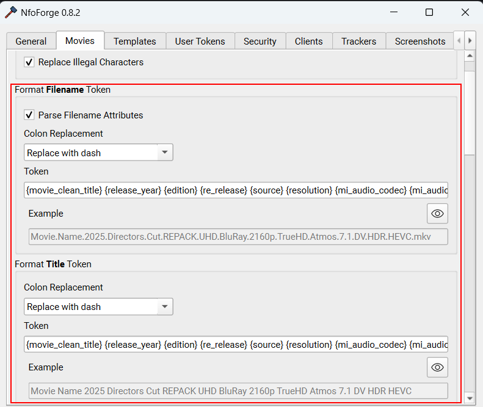

# Flat Strings

<!-- prettier-ignore -->
!!! tip "Flat Strings"
    Flat strings are defined by a **single line** of text.  
    *e.g. `Big.Buck.Bunny.2008.BluRay.1080p.MP2.2.0.x264`.*

NfoForge will automatically use the formatter in **flat** mode for paths (files and folders).

### Format

[FileTokens](introduction.md) are only available in **flat** mode when used directly in NfoForge. You'll notice that flat tokens have a single set of brackets, e.g., `{title}`.

### Usage

A token string is simply a combination of tokens and text.

<!-- prettier-ignore -->
!!! question "What is a string?"
    A string is a sequence of characters. This includes letters, numbers, and symbols.

**Example of a token string:**

```text
{title_clean} {release_year} {edition} {re_release} {source} {resolution} {audio_codec} {audio_channel_s} {video_dynamic_range_type_inc_sdr_over_1080} {video_codec}
```

**When filled:**

```text
Movie Name 2025 Directors Cut REPACK UHD BluRay 2160p TrueHD Atmos 7.1 DV HDR HEVC
```

The output will vary based on the file that is opened. If you are familiar with Radarr/Sonarr, this works very similarly.

### Optional Text

You can use tokens with an optional syntax to only add text **if** the token is filled by the formatter. This is done with the syntax `:opt=*:`, where you replace the asterisk with whatever text you want.

**Example of a token string with opt syntax:**

```text
{title_clean} {:opt=(:release_year:opt=):} {edition} {re_release} {source} {resolution} {audio_codec} {audio_channel_s} {video_dynamic_range_type_inc_sdr_over_1080} {video_codec}
```

Note the token `{:opt=(:release_year:opt=):}`. We're using `:opt=(:` and `:opt=):` to wrap the year with parentheses. This allows for many use cases and enables a high degree of customization.

**When filled with opt syntax:**

```text
Movie Name (2025) Directors Cut REPACK UHD BluRay 2160p TrueHD Atmos 7.1 DV HDR HEVC
```

You can see this in action in real time inside **NfoForge** under **Settings -> Movies Management**.

{ width=100%, style="max-width: 500px;" }

### Filters

You can apply several filters to filled tokens to fine-tune your output. Each example below defines a string and shows the result before and after applying a filter. Filters are simple to use:

- Define a filter using the `|` character inside the brackets, immediately after the token name: `{token|filter}`.
- You can still use **opt** for optional text, but filters are only applied to the token value itself. The filter must be placed before **opt**. For example: `{:opt=x:token|filter:opt=x:}`.

<!-- prettier-ignore -->
!!! info
    Filters work identically to their Python [equivalents](https://docs.python.org/3/library/stdtypes.html#string-methods).

#### upper

{example_token} = tom

```text
{:opt=hi :example_token|upper}
```

```text
hi TOM
```

#### lower

{example_token} = TOM

```text
{:opt=hi :example_token|lower}
```

```text
hi tom
```

#### title

{example_token} = TOM

```text
{:opt=hi :example_token|title}
```

```text
hi Tom
```

#### swapcase

{example_token} = Tom

```text
{:opt=hi :example_token|swapcase}
```

```text
hi tOM
```

#### capitalize

{example_token} = tom

```text
{:opt=hi :example_token|capitalize}
```

```text
hi Tom
```

#### zfill

{example_token} = 42

```text
{:opt=hi :example_token|zfill(5)}
```

```text
hi 00042
```

#### replace

{example_token} = tom

```text
{:opt=hi :example_token|replace("m", "mmy")}
```

```text
hi tommy
```

You can use single or double quotes for the arguments, and any character (including commas, spaces, or quotes) can be replaced. For example:

```text
{:opt=hi :example_token|replace(',', '-')}
{:opt=hi :example_token|replace('foo,bar', 'baz,qux')}
```

#### default

Supplies a value when the token resolves to nothing. Every other filter describes a value it was given, so it is skipped when there is nothing to describe; `default` is the one filter that acts on an empty token.

{release_group} = (no release group)

```text
{:opt=-:release_group|default('NOGROUP')}
```

```text
-NOGROUP
```

When the token does have a value, `default` leaves it alone.

#### only_if / unless

Keeps or drops a value depending on whether _other_ tokens resolve to anything. `only_if` keeps the value only when every token it names has a value; `unless` drops the value when any of them does. Both take one or more comma-separated token names.

This is how one template can carry two component orders and emit whichever fits the release. Several trackers order a remux differently from an encode — audio last for a remux, audio first for an encode:

```text
{resolution} {source}{:opt= :remux}{:opt= :video_dynamic_range_type|only_if(remux)}{:opt= :video_codec|only_if(remux)}{:opt= :audio_codec}{:opt= :audio_channel_s}{:opt= :video_dynamic_range_type|unless(remux)}{:opt= :video_codec|unless(remux)}
```

```text
2160p UHD BluRay REMUX DV HDR HEVC TrueHD 7.1
1080p BluRay TrueHD 7.1 DV HDR x265
```

Naming a token that does not exist leaves the value untouched and logs a warning, so a typo cannot silently delete a component.

<!-- prettier-ignore -->
!!! tip
    Write the separator as part of the token (`{:opt= :token}`) rather than as a literal space between tokens. The optional string disappears along with the value, so a filter that blanks a token cannot leave a stray space or a dangling `-` behind.

### Chained Filters

You can chain multiple filters together by separating them with `|`. Filters are applied in order from left to right.

{example_token} = tom

```text
{:opt=hi :example_token|replace("m", "mmy")|upper}
```

```text
hi TOMMY
```

### Additional Information

There are three built-in rename token strings:

<!--prettier-ignore-start -->

- **Filename** token string
    - The filename (or folder, if applicable) is shared across all trackers.
    - There can only be one of these tokens.
- **Title** token string (global)
    - A single global token shared across all trackers that don't have an override.
- Per-tracker **Title** token string override
    - Overrides the global title token for each tracker.

<!--prettier-ignore-end -->
