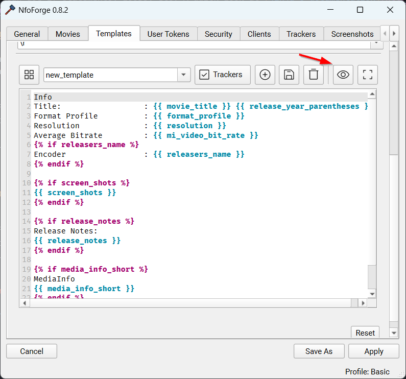
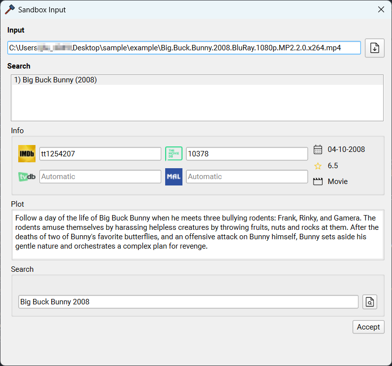
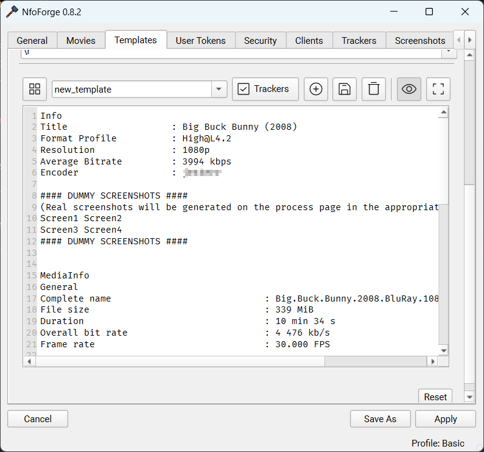

# Multi-line Strings

<!-- prettier-ignore -->
!!! tip "Multi-line Strings"
    Multi-line strings are defined by **one or more lines** of text.  
    ```text
    Title         : Big Buck Bunny (2008)
    Resolution    : 1080p
    File size     : 339 MiB
    ```

### Format

For multi-line strings **both** [FileTokens](introduction.md) and [NfoTokens](introduction.md) are available for use in NfoForge. Also, multi-line tokens **must** use **two** sets of brackets, e.g., `{{ movie_title }}`.

<!-- prettier-ignore -->
!!! tip
    Whitespace inside the tokens is not required *(is ignored)*, but by convention, your tokens should have a space before the text inside the token. e.g., `{{ movie_title }}` instead of `{{movie_title}}`.

### Usage

This part of NfoForge's formatter utilizes [Jinja](https://jinja.palletsprojects.com/en/stable/).

<!-- prettier-ignore -->
!!! question "What is Jinja?"
    Jinja is a fast, expressive, extensible templating engine. Special placeholders in the template allow writing code similar to Python syntax. The template is then passed data to render the final document.

**Example of a token string:**

```jinja {.scrollable-code-block}
Info
Title                   : {{ movie_title }} {{ release_year_parentheses }}
Format Profile          : {{ format_profile }}
Resolution              : {{ resolution }}
Average Bitrate         : {{ mi_video_bit_rate }}

Encoder                 : {{ releasers_name }}



{{ screen_shots }}



Release Notes:
{{ release_notes }}



MediaInfo
{{ media_info_short }}


{{ shared_with_bbcode }}
```

**When filled:**

```text {.scrollable-code-block}
Info
Title                   : Big Buck Bunny (2008)
Format Profile          : High@L4.2
Resolution              : 1080p
Average Bitrate         : 3994 kbps
Encoder                 : anon

#### DUMMY SCREENSHOTS ####
(Real screenshots will be generated on the process page in the appropriate format for the tracker)
Screen1 Screen2
Screen3 Screen4
#### DUMMY SCREENSHOTS ####

MediaInfo
General
Complete name                            : Big.Buck.Bunny.2008.BluRay.1080p.MP2.2.0.x264.mp4
File size                                : 339 MiB
Duration                                 : 10 min 34 s
Overall bit rate                         : 4 476 kb/s
Frame rate                               : 30.000 FPS

Video
ID                                       : 1
Format                                   : AVC
Format profile                           : High@L4.2
Duration                                 : 10 min 34 s
Bit rate                                 : 4 000 kb/s
Width                                    : 1 920 pixels
Height                                   : 1 080 pixels
Display aspect ratio                     : 16:9
Frame rate                               : 30.000 FPS
Color space                              : YUV
Chroma subsampling                       : 4:2:0
Bit depth                                : 8 bits

Audio #1
ID                                       : 2
Commercial name                          : MPEG Audio
Codec ID                                 : mp4a-6B
Bit rate                                 : 160 kb/s
Channel(s)                               : 2 channels
Sampling rate                            : 48.0 kHz

Audio #2
ID                                       : 3
Commercial name                          : Dolby Digital
Codec ID                                 : ac-3
Bit rate                                 : 320 kb/s
Channel(s)                               : 6 channels
ChannelLayout_Original                   : L R C LFE Ls Rs
Sampling rate                            : 48.0 kHz


Shared with [url=https://github.com/jesterr0/NfoForge]NfoForge v0.8.2[/url]
```

### Additional Information

You can use if statements, loops, etc. A quick look at [Jinja's documentation](https://jinja.palletsprojects.com/en/stable/templates/) can help you understand these features if you aren't familiar.

**Conditional Example:**

Suppose you have filled in a movie, but you're unsure if there will be an **edition**. You can add this in an if statement and only display **Edition** if it's available or detected.

```jinja
Info
Title                   : {{ movie_title }} {{ release_year_parentheses }}

Edition                 : {{ edition }}

Edition                 : None

```

<!-- prettier-ignore -->
!!! info
    Detects if there is an edition detected and fills it with a clean formatted output. If there is not any editions detected it outputs 'None' as the edition.

**Output:**

```text
Info
Title                   : Big Buck Bunny (2008)
Edition                 : Extended Cut
```

### Jinja Filters

While I can't go over all of what jinja [supports](https://jinja.palletsprojects.com/en/stable/templates/#list-of-builtin-filters) _(it would take forever and they have very clean documentation)_, I figured I could go over a quick useful example called the **replace** filter. This works identically to Pythons built in string function replace.

**Example:**

```jinja
{{ mi_audio_bitrate_formatted }}
```

**Output:**

```text
160 kb/s
```

Let's say you want to swap `/` for `'`.

**In:**

```jinja
{{ mi_audio_bitrate_formatted|replace("/", "'") }}
```

**Out:**

```text
160 kb's
```

You can also chain multiple filters together.

**In:**

```jinja
{{ mi_audio_bitrate_formatted|replace("/", "'")|replace(" ", "") }}
```

**Out:**

```text
160kb's
```

### Sandbox

In NfoForge, open **Settings → Templates** to build templates and use the sandbox feature. Once you have created a new template, you can click the icon to preview your filled template.

{ width=100%, style="max-width: 500px;" }

Open a file to test out the sandbox (this brings up the search widget to parse the file's details).

{ width=100%, style="max-width: 500px;" }

<!-- prettier-ignore -->
!!! tip
    As long as you stay in the settings window, the file is cached and won't have to be reloaded for each change to your template when modifying or testing things out.

You will see the filled template. Here, you can deselect the preview button to make changes to the template and test things out as many times as you'd like.

{ width=100%, style="max-width: 500px;" }
