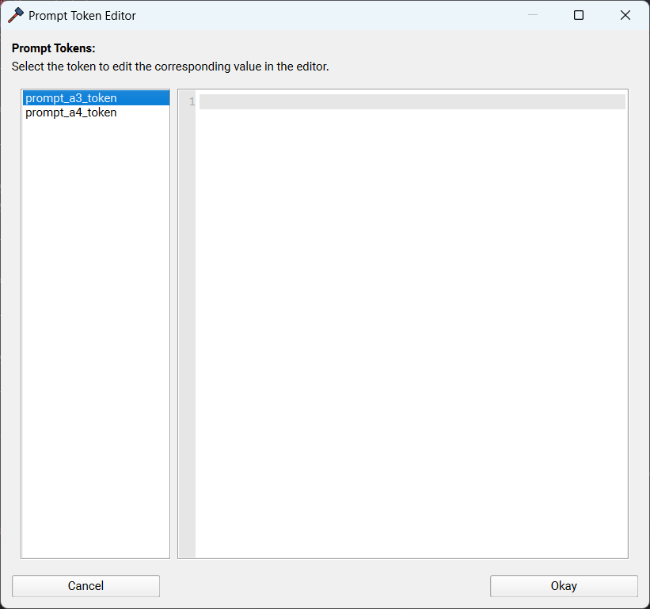

# Prompt Tokens

Prompt tokens are **single-use** tokens that prompt the user for input during the workflow, allowing you to format NFO templates wherever a prompt token appears. They are considered a type of **NfoToken**, but are only defined at runtime and are not retained for your next workflow.

<!-- prettier-ignore -->
!!! tip
    If you're looking for tokens that are static, refer to [user tokens](advanced.md#user-tokens).

### Format and Information

Prompt tokens are formatted identically to [multi-line tokens](multi-line.md#format), with a few key differences:

- They must be prefixed with **prompt\_**.
- Tokens are only defined in the NFO template.
- Tokens should consist of all lowercase word characters.
- Tokens are used **exactly** as the user inputs them; no whitespace or additional new lines will be stripped, and no other formatting will be applied.

### Usage

See the example below, where the token **{{ prompt_source }}** is defined in the template.

```jinja {.scrollable-code-block}
Title                   : {{ movie_title }} {{ release_year_parentheses }}
Format Profile          : {{ format_profile }}
Resolution              : {{ resolution }}


Source                  : {{ prompt_source }}

```

<!-- prettier-ignore -->
!!! question "Is the if statement required?"
    The if statement is not required when using prompt tokens. However, it is good practice to include it in case the user does not provide a value when prompted.

### Identical Tokens in Multiple Templates

Suppose you are releasing to multiple trackers simultaneously.

**MoreThanTV:**

```jinja {.scrollable-code-block}
...

Source                  : {{ prompt_source }}

...
```

**TorrentLeech:**

```jinja {.scrollable-code-block}
...

Source                  : {{ prompt_source }}


Source Type             : {{ prompt_source_type }}

...
```

**BeyondHD:**

```jinja {.scrollable-code-block}
...

Sources                 : {{ prompt_sources }}

...
```

Across these three templates, there are **three** prompt tokens defined, of which **two** are unique. During the workflow, you will be prompted once to fill in all the tokens. Tokens that are **identical** will be filled with the same value provided by the user.

If the user provides the following values:

- prompt_source = Some Group
- prompt_source_type = BluRay
- prompt_sources = Some Group 1, Some Group 2, Some Group 3

**MoreThanTV:**

```jinja {.scrollable-code-block}
...
Source                  : Some Group
...
```

**TorrentLeech:**

```jinja {.scrollable-code-block}
...
Source                  : Some Group
Source Type             : BluRay
...
```

**BeyondHD:**

```jinja {.scrollable-code-block}
...
Sources                 : Some Group 1, Some Group 2, Some Group 3
...
```

<!-- prettier-ignore -->
!!! info
    Note that **shared** tokens will have the same value across all templates. If you need unique values, make sure to use different prompt tokens in each template.

### NfoForge Example

**Template:**

```jinja
{{ prompt_a3_token }}

{{ prompt_a4_token }}
```

**Editor:**

{ width=100%, style="max-width: 500px;" }

<!-- prettier-ignore -->
!!! info
    The pop-up will warn you if any token values are unfilled, giving you another chance to correct them if needed.
